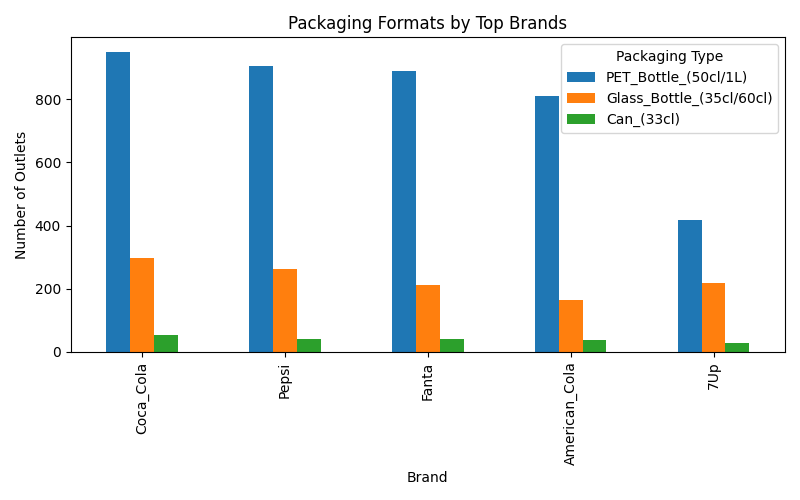
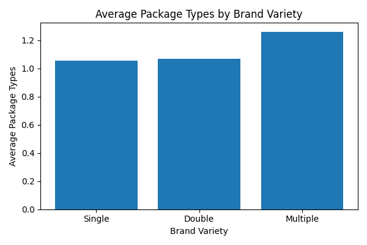
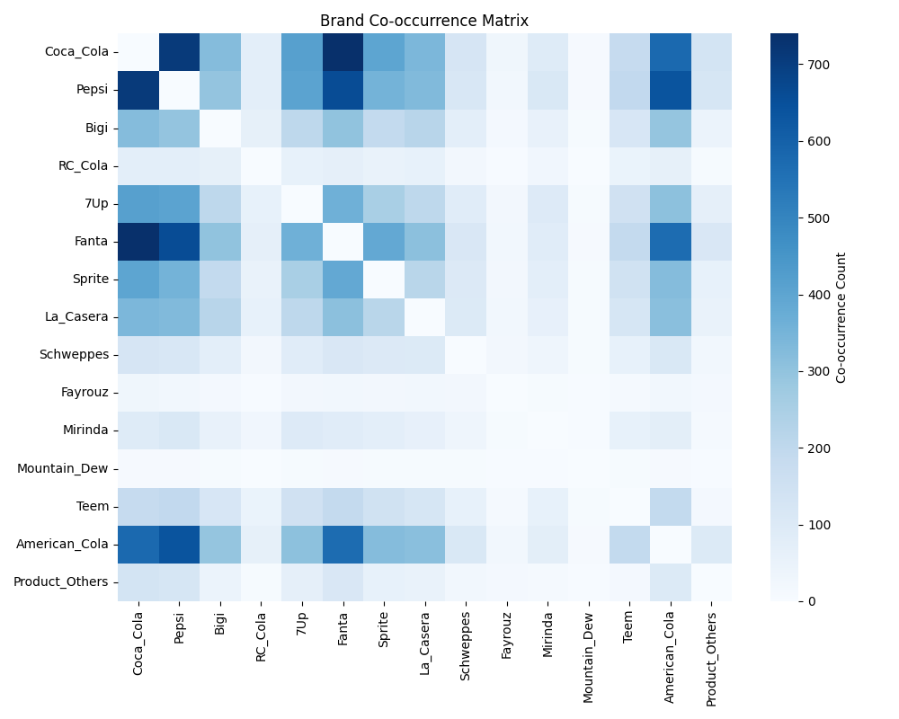
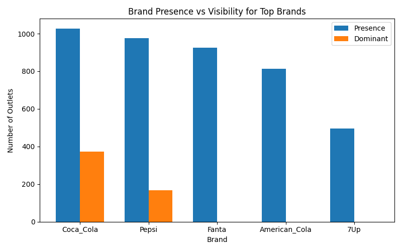

# Soft Drink Market Insight Challenge – Analysis & Findings

## Introduction
I am Dotun Olatunde and in this project, I'll be analyzing and drawing insights from Alimosho's soft drink market as part of my contributions to the *#NervsDataChallenge.*

## Project Overview
This document summarizes an exploratory analysis of the Soft Drink Market Insight Challenge data from Alimosho Local Government Area of Lagos, Nigeria. The goal was to clean the raw survey data, derive useful features and visualise patterns in soft‑drink availability, packaging, outlet types and brand presence. Although the dataset captures supply‑side information (what outlets stock and how prominently), careful analysis can still reveal much about consumer demand and market dynamics.

## Tools and Data
Data for this project was gotten from the following repo: **github.com/getnervs/Soft-Drink-Market-Insight-Challenge** and it was cleaned and analyzed with the **Python** programming language.
The following *Python packages* were used for analysis and visualizations:

- Matplotlib
- PANDAS,
- Plotly,
- Regex
- Streamlit

To install these packages, please use the command **pip install (package e.g. streamlit)** on your command-line interface.

## Data Cleaning & Feature Engineering

The original CSV contained grouping rows, inconsistent column names and several nearly empty fields. Cleaning steps included:

- Skipping the first grouping row when loading the file (header=1).
- Stripping and standardising column names: converting spaces to underscores, fixing misspellings (refridgerator → refrigerator) and retaining meaningful punctuation.
- Splitting the three ambiguous “Others” columns into Product_Others, Display_Others and Package_Others.
- Dropping columns with more than 80 % missing values and those with only a single non‑zero value.
- Converting binary indicator columns to numeric (0/1) and fixing their types.
- Standardizing numeric columns and ensuring that data contained no outliers
- Creating several derived features to support analysis:
  - num_brands_present – number of different brands stocked at each outlet.
  - num_package_types – number of distinct package formats (PET, glass, can).
  - brand_variety – a categorical flag (Single, Double, Multiple) based on num_brands_present.
  - dominant_brand – the drink given the most shelf/refrigerator space.

After cleaning, the dataset had 1 500 rows and 30 columns with no missing values in the retained fields. Latitude and longitude were left in raw form for mapping, while the serial number (S/N) was set as the DataFrame index.

## Visualisations & Insights

The cleaned dataset supports a rich set of visualisations.  Below are the key findings, each accompanied by a static snapshot from the dashboard.  The interactive versions can be explored in the Streamlit app.

- **Stock condition distribution:** 43.2 % of outlets are *partially stocked* and 39.7 % are *well stocked*.  Only 15.0 % are *almost empty*, 0.9 % are *out of stock* and 1.2 % were *not applicable*.  This indicates that supply chains are generally resilient with only isolated shortages.

  

- **Brand presence:** The market is concentrated among a few key players.  **Coca‑Cola** appears in 68.5 % of outlets, **Pepsi** in 65.1 % and **Fanta** in 61.7 %.  American Cola (54.2 %) and 7Up (33.1 %) form a second tier, while drinks like Mountain Dew (0.6 %) and RC Cola (6.0 %) are stocked only rarely.  This skew suggests a highly competitive landscape with a handful of dominant brands.

  

  - **Packaging type distribution:** Packaging choices are overwhelmingly weighted towards **PET bottles**, which are present in 91.2 % of outlets.  Glass bottles appear in 24.6 % and cans in 4.1 %.  A pie chart in the dashboard underlines how dominant PET packaging is, reflecting consumer demand for resealable, portable containers.

    

- **Stock condition by outlet type:** Shops account for 85.9 % of all outlets and contain the largest number of well‑stocked cases.  Kiosks and hawkers show smaller counts and a higher proportion of “Almost empty” statuses.  Supermarkets, though few in number, rarely run out of stock.  This pattern indicates that larger retail formats maintain deeper inventories.

  

- **Brand variety categories:** Variety is the norm: 69.5 % of outlets carry three or more brands (*Multiple*), 18.0 % carry two brands (*Double*) and only 12.5 % carry a single brand (*Single*).  These proportions are illustrated with a pie chart in the dashboard.

  

- **Packaging formats by brand:** A grouped bar chart compares PET, glass and can usage for the top five brands.  All leading brands rely heavily on PET bottles, while glass and cans are niche formats.  Fanta and Pepsi show slightly higher glass usage than Coca‑Cola, hinting at different positioning strategies.

  

  - **Brand variety vs packaging variety:** Outlets that stock more brands also tend to carry more packaging formats.  The average number of package types rises from about 1.1 for single‑brand outlets to 1.6 for double‑brand outlets and 2.0 for multi‑brand outlets.  This suggests that variety at the brand level often goes hand‑in‑hand with variety in packaging.

    

  - **Packaging formats by outlet type:** A stacked bar chart compares PET, glass and can usage across outlet categories.  Shops dominate PET usage, while kiosks, hawkers and market stalls show much smaller counts across all formats.  This reveals how infrastructure and scale shape packaging choices.

  - **Display methods by outlet type:** Another stacked bar chart (available in the interactive dashboard) shows how outlets present their products: shops and supermarkets rely heavily on shelves and refrigerators, whereas kiosks and hawkers seldom use coolers or display stands.  These patterns reflect differences in space, equipment and target customers.

- **Brand co‑occurrence matrix:** A heatmap counts how often each pair of brands is stocked together.  Darker squares highlight popular pairings – for example, Coca‑Cola frequently co‑occurs with Fanta and Pepsi – offering a market‑basket view of complementary demand.

  

- **Brand presence vs visibility:** Being stocked everywhere does not guarantee prime shelf placement.  A grouped bar chart compares presence and dominance counts for the top brands.  For example, Coca‑Cola is present in 1 028 outlets but dominant in only 373 (~36 %), and Pepsi is present in 977 outlets but dominant in 166 (~17 %).  This reveals which brands retailers prioritise when allocating shelf space.

  

- **Top product combinations:** The most common assortments include single Coca‑Cola, Coca‑Cola with Fanta, and Pepsi with American Cola.  These combinations highlight which brands are frequently purchased together, providing clues about complementary demand or cross‑promotion at the point of sale.

  

- **Outlet locations:** A scatter map of outlets by latitude and longitude shows that most points cluster in central Alimosho.  Colouring by stock condition reveals no obvious geographic pattern to stockouts, suggesting that shortages are dispersed rather than concentrated.  The interactive map in the dashboard allows users to colour points by outlet type or stock condition.

  

## Consumer Trend Inferences

Although the survey doesn’t track individual purchases, it does reveal several demand‑side signals:

- *Dominant brands receive the most shelf space:* Coca‑Cola and Pepsi not only appear most often but are frequently listed as the product with the highest shelf/refrigerator presence. This implies strong consumer pull and retailer confidence.
- *Variety matters:* The majority of outlets stock multiple brands, which suggests that shoppers expect choice and that no single brand completely satisfies local demand.
- *Portable packaging dominates:* The prevalence of PET bottles aligns with on‑the‑go consumption habits typical of busy urban areas. Glass and cans play a secondary role, likely tied to dine‑in or premium experiences.
- *Common brand combinations reflect complementary demand:* The frequent pairing of Coca‑Cola with Fanta and Pepsi with American Cola indicates that consumers often buy these drinks together, prompting retailers to stock them side by side.

## Conclusion

This analysis shows a soft‑drink market dominated by a handful of brands and packaging formats, with retailers largely able to keep products on the shelf. Shops carry the broadest assortments and maintain the healthiest inventories, while smaller formats like kiosks and hawkers exhibit more variability in stock levels. By combining thoughtful data cleaning, feature engineering and visual storytelling, we can infer consumer preferences and market dynamics even from outlet‑level data.

You can find static snapshots of my dashboard in the folder named **plot** in this repo.
Feel free to also explore the interactive dashboards by clicking **[here](https://my-visualizations.streamlit.app)** or via the Streamlit app in this repository for a deeper dive into the data and to experiment with different filters.

## Got questions or feedback ?
I would really love to hear from you. please click *[here](https://wa.me/+2348027834543)* to chat with me on WhatsApp or send me an email via **olatundedotun6@gmail.com.**